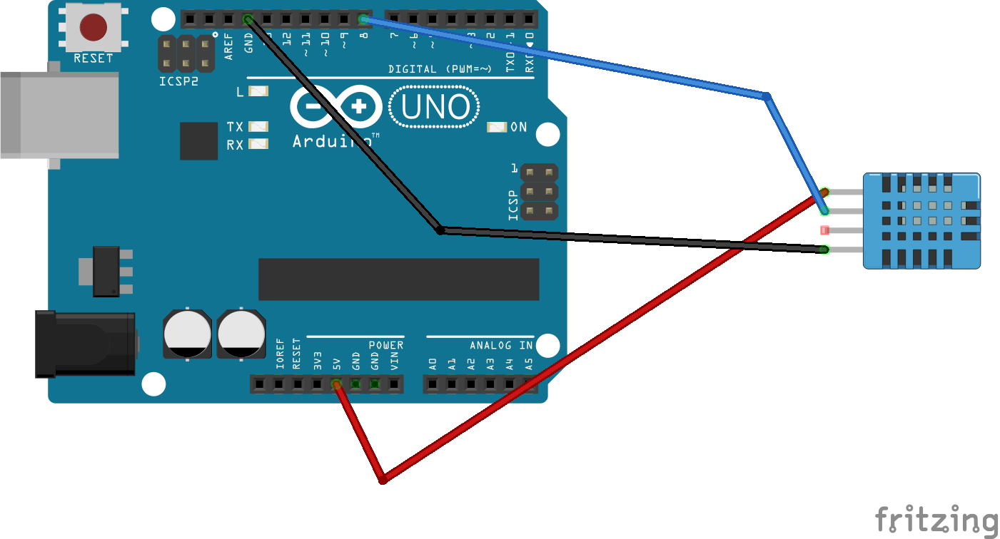

# XBee-based temperature sensor

Collects temperature/humidity observations via an XBee device - in this case, hosted on an Arduino.

## Preparing the Arduino

Download the [Arduino IDE](https://www.arduino.cc/en/Main/Software) and connect your Arduino
to your PC (most likely via USB).

### Setup the sensor circuit

__ALWAYS disconnect your Arduino BEFORE setting up your cicuits.__

A [DHT 11](https://www.adafruit.com/product/386)
temperature/humidity sensor is used. Check out the
[Adafruit library](https://github.com/adafruit/Fritzing-Library) for
parts to use in your diagrams. I'm actually using a part from the
[Iduino sensor kit](http://www.openplatform.cc/index.php/home/index/details/apiid/79)
and the part includes an on-board resistor so I don't need to

Pins:

- 1 - VCC
- 2 - Data out
- 4 - Ground

I've included a [Fritzing](https://fritzing.org/home/) diagram [for the basic circuit](circuit.fzz).



### Test the sensor

The [dh11_basic.ino](arduino/dh11_basic/dh11_basic.ino) provides
a basic sketch for taking a sensor read every ~5 seconds. The built-in
LED will also quickly flash to let you know that a read was attempted.

To start with, you'll need to install a library for accessing the
DHT 11 sensor. There are a few out there but I used `Simple DHT`.
Open the `Sketch -> Include Library -> Manage Libraries` menu
and install the
[`Simple DHT`](https://github.com/winlinvip/SimpleDHT) library.

Next, open the `dh11_basic.ino` sketch and upload it to your Arduino.

A series of correct read looks like:

    30,22
    31,23

With the first number being the temperature and the second being the humidity

An error line looks something like:

    e,4112

The `4112` is a Data Read error - check out the library
[header file](https://github.com/winlinvip/SimpleDHT/blob/master/SimpleDHT.h)
for details.

## Go wireless

### Configuring the XBee

Download the [XCTU software](https://www.digi.com/products/embedded-systems/digi-xbee/digi-xbee-tools/xctu) and refer to the
[user guide for installation instructions](https://www.digi.com/resources/documentation/digidocs/90001458-13/default.htm#concept/c_90001458-13_start.htm%3FTocPath%3D_____1).

I use a [SparkFun XBee Explorer Dongle](https://www.sparkfun.com/products/11697) to configure
the XBees. Basically, you attach the XBee to the dongle, insert the USB and use XCTU to configure the
XBee.

### Base node

One of the XBees will be attached to the central hub and collect
data from sensors. I refer to this as the `base` node.

- [ID] PAN ID: `7674`
- [DL] Destination Address Low: `2001`
- [MY] 16-bit Source Address: `5001`
- [NI] Node identifier: `base`
- [AP] API Enable: `API enabled w/PPP [2]`
- [CE] Coordinator Enable: `Coordinator [1]`

### Sensor node

One other XBee will be attached to the Arduino and will
communicate sensor readings. I refer to this as the `sensor_temp_1` node.

- [ID] PAN ID: `7674`
- [DL] Destination Address Low: `5001`
- [MY] 16-bit Source Address: `2001`
- [NI] Node identifier: `sensor_temp_1`
- [AP] API Enable: `API enabled w/PPP [2]`
- [CE] Coordinator Enable: `End Device [0]`

### Arduino sketch

I'm running an Arduino Uno clone with a
[DF Robot XBee shield](https://wiki.dfrobot.com/Xbee_Shield_For_Arduino__no_Xbee___SKU_DFR0015_).
The XBee easily slots into the shield and

[XBee-Arduino library by Andrew Rapp](https://github.com/andrewrapp/xbee-arduino)

## Testing data collection

### Python

Make sure you have [`pipenv`](https://pipenv.readthedocs.io/en/latest/) installed and
open up a terminal in the `test-app` folder. Install the requirements with:

    pipenv install

You can get the sensor data using `sensor.py`:

    pipenv run python sensor.py

You should start to see the following output:

    Node base is waiting for data...

    {"timestamp": "2019-12-30T15:15:59.105540+10:00", "device": {"node_id": "sensor_temp_1", "16bit_addr": "20 01"}, "observations": {"temperature": 32, "humidity": 29}}
    {"timestamp": "2019-12-30T15:16:04.148662+10:00", "device": {"node_id": "sensor_temp_1", "16bit_addr": "20 01"}, "observations": {"temperature": 32, "humidity": 29}}
    {"timestamp": "2019-12-30T15:16:09.191380+10:00", "device": {"node_id": "sensor_temp_1", "16bit_addr": "20 01"}, "observations": {"temperature": 32, "humidity": 29}}
    {"timestamp": "2019-12-30T15:16:14.234035+10:00", "device": {"node_id": "sensor_temp_1", "16bit_addr": "20 01"}, "observations": {"temperature": 30, "humidity": 19}}

The `debug.py` script will give you some info about the XBee network:

    pipenv run python debug.py

You'll get a diagnostic output as follows:

````
Cheking network...done

LOCAL XBEE
  - Node ID: base
  - PAN ID: 76 74
  - Protocol: XBeeProtocol.RAW_802_15_4
  - 16-bit address: 50 01
  - 64-bit address: 0013A200416A88FF
  - API: 02
  - Encryption enabled: 01
  - Hardware version: HardwareVersion.XB24_AXX_XX
  - Firmware version: 10 EF

NETWORK
  - Remote devices: 1


REMOTE DEVICE:
- Node ID: sensor_temp_1
- PAN ID: 76 74
- Protocol: XBeeProtocol.RAW_802_15_4
- 16-bit address: 20 01
- 64-bit address: 0013A2004179B88B
- API: 02
- Encryption enabled: 01
- Hardware version: HardwareVersion.XB24_AXX_XX
- Firmware version: 10 EF
````


### Container

Build the container:

    docker build -t hub-sensor-xbee-temp .

To run the container (by default this calls `sensor.py`):

    docker run --rm -ti --device /dev/ttyUSB0 hub-sensor-xbee-temp:latest

You can also run `debug.py` with:

    docker run --rm -ti --device /dev/ttyUSB0 hub-sensor-xbee-temp:latest debug.py

To run an interactive container:

    docker run --rm -ti --device /dev/ttyUSB0 --entrypoint /bin/sh hub-sensor-xbee-temp:latest

## References

* [Digi XBee Python library](https://github.com/digidotcom/python-xbee)
* [XBee®/Arduino Compatible Coding Platform](https://github.com/digidotcom/XBeeArduinoCodingPlatform)
* [XBee API Mode Tutorial Using Python and Arduino](https://serdmanczyk.github.io/XBeeAPI-PythonArduino-Tutorial/)
* [Programming Arduino Wirelessly](https://www.faludi.com/itp_coursework/meshnetworking/XBee/XBee_program_Arduino_wireless.html)
* [http://www.fiz-ix.com/2012/11/low-power-xbee-sleep-mode-with-arduino-and-pin-hibernation/](http://www.fiz-ix.com/2012/11/low-power-xbee-sleep-mode-with-arduino-and-pin-hibernation/)
